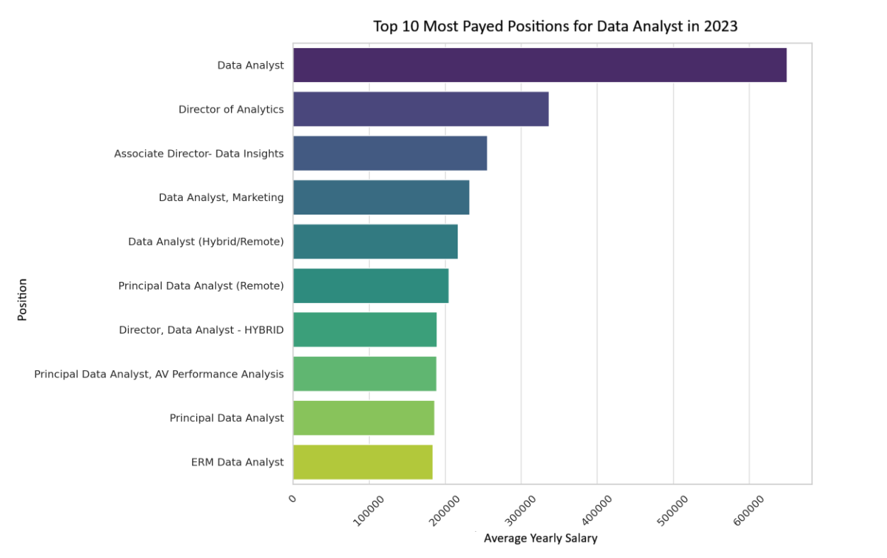
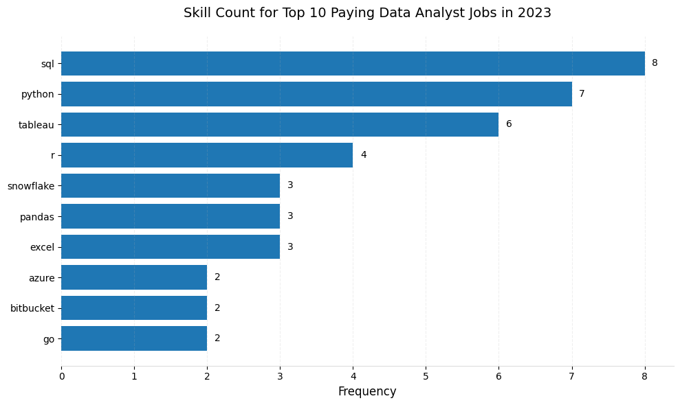

# 📊 IT Job Market Data Analysis (SQL Project)

## 📁 Introduction  
This project focuses on analyzing a database related to the IT job market - including salaries, required skills, and job types. 
The analysis was performed using SQL in PostgreSQL, with all code and queries organized in the [project_sql folder](/project_sql) folder.

## 🧠 Background  
This project is based on a [YouTube course by Luke Barousse](https://www.youtube.com/watch?v=7mz73uXD9DA&t=822s), which provided a great foundation for practicing real-world data analysis using SQL. My goal was to deepen my knowledge of SQL and gain hands-on experience by exploring a dataset related to tech job offers.  

It was a great opportunity to improve my skills in querying, data cleaning, and insight generation - all within the context of the IT job market.

### The questions answered through the SQL queries were:
1. What are the top-paying data analyst jobs?
2. What skills are required for these top-paying jobs?
3. What skills are most in demand for data anlysts?
4. What skills are associated with higher salaries?
5. Which are the most optimal skills to learn?

## 🛠️ Tools I Used  
- **SQL**: The core tool used for querying and analyzing the data.
I applied various techniques such as filtering, joining tables, using subqueries, creating CTEs and aggregations to extract meaningful insights from the dataset.
- **PostgreSQL**: I used it to import and store the dataset, write SQL queries, and perform all data operations.
  Its support for advanced SQL features like CTEs, window functions, and indexing made it ideal for this type of analysis.
- **Visual Studio Code**: Served as my main development environment. With the help of SQL extensions and PostgreSQL integration, it allowed me to write, run, and manage SQL scripts efficiently.
- **Git & GitHub**: Essential for version control to track changes, manage code versions, and maintain a clean development workflow.


## 📈 The Analysis  

### 1. Top-Paying Data Analyst Jobs

This query filters job postings for **Data Analyst** positions based on **average yearly salary** and **location**, with a specific focus on **remote jobs**. The goal is to identify the highest-paying options available on the market.

By narrowing the results to remote jobs, this analysis highlights top-paying roles that offer flexibility and are accessible regardless of geographic location. It provides valuable insight for job seekers who are looking for well-compensated, remote-friendly data analyst positions.
```sql
SELECT 
    job_id,
    cd.name AS company_name,
    job_title,
    job_location,
    job_schedule_type,
    salary_year_avg,
    job_posted_date
  
FROM
  job_postings_fact jpf
LEFT JOIN company_dim cd ON jpf.company_id = cd.company_id
WHERE jpf.salary_year_avg IS NOT NULL 
  AND jpf.salary_year_avg > 0
  AND jpf.job_title IS NOT NULL
  AND jpf.job_location = 'Anywhere'
  AND jpf.job_title_short = 'Data Analyst'
ORDER BY jpf.salary_year_avg DESC 
LIMIT 10;
```

*Bar graph visualizing the salary for the top 10 salaries for data anlysts; ChatGPT generated this graph from my SQL query results*

### 2. Skills for Top-Paying Jobs

This query identifies the **top 10 highest-paying Data Analyst roles** (remote only) and then extracts the **skills associated** with those specific job postings.

It uses a Common Table Expression (CTE) to first select the top-paying remote Data Analyst jobs based on average annual salary. 
The final result joins this list with the skills dimension tables to reveal which technical skills are most commonly required in the most lucrative positions.

This analysis helps highlight which tools, technologies, or programming languages are most valuable to secure a high-paying remote role as a Data Analyst.

``` sql
WITH top_paying_jobs AS (
    SELECT 
        job_id,
        cd.name AS company_name,
        job_title,
        salary_year_avg
    FROM job_postings_fact jpf
    LEFT JOIN company_dim cd ON jpf.company_id = cd.company_id
    WHERE jpf.salary_year_avg IS NOT NULL 
      AND jpf.salary_year_avg > 0
      AND jpf.job_title IS NOT NULL
      AND jpf.job_location = 'Anywhere'
      AND jpf.job_title_short = 'Data Analyst'
    ORDER BY jpf.salary_year_avg DESC 
    LIMIT 10

)
SELECT 
    tpj.*,
    sd.skills
FROM top_paying_jobs tpj
JOIN skills_job_dim sjd ON tpj.job_id = sjd.job_id
JOIN skills_dim sd ON sjd.skill_id = sd.skill_id


```
Here's the breakdown of the most demanded skills for the top 10 highest paying data analyst jobs in 2023:
- **SQL** is leading with a bold count of 8.
- **Python** follows closely with a bold count of 7.
- **Tabeleau** is also highy sought after, with a bold count of 6. Other skills like **R, Snowflake, Pandas** and **Excel** show varying degrees of demand.


*Bar graph visualizing the count of skills for the top 10 paying jobs for data anlysts; ChatGPT generated this graph from my SQL query results*

### 3. In-Demand Skills for Data Analysts

This query helped identify the skills most frequently requested in job postings, directing focus to areas with high demand.

``` sql
SELECT 
    sd.type AS skill_type,
    sd.skills,
    COUNT(sd.skills) AS skill_count
FROM job_postings_fact
INNER JOIN skills_job_dim sjd ON job_postings_fact.job_id = sjd.job_id
INNER JOIN skills_dim sd ON sjd.skill_id = sd.skill_id
WHERE job_title_short = 'Data Analyst'
GROUP BY sd.skills, sd.type, sd.skill_id
ORDER BY skill_count DESC
LIMIT 5;
```

Here's the breakdown of the most demanded skills for data analysts in 2023

- **SQL** and **Excel** remain fundamental, emphasizing the need for strong foundational skills in data processing and spreadsheet manipulation.
- **Programming** and **Visualization Tools** like **Python, Tableau,** and **Power BI** are essential, pointing towards the increasing importance of technical skills in data storytelling and decision support.

| 💡 Skill     | 📊 Demand Count |
|-------------|:---------------:|
| SQL         |     7,291       |
| Excel       |     4,611       |
| Python      |     4,330       |
| Tableau     |     3,745       |
| Power BI    |     2,609       |

*Table of the demand for the top 5 skills in data analyst job postings*

### 4. Skills with Higher Salaries
Exploring the average salaries associated with different skills revealed which skills are the highest paying.
``` sql
SELECT
    sd.skills,
    ROUND(AVG(salary_year_avg), 0) AS average_salary,
    COUNT(jpf.job_id) AS job_count
FROM job_postings_fact jpf
JOIN skills_job_dim sjd ON jpf.job_id = sjd.job_id
JOIN skills_dim sd ON sjd.skill_id = sd.skill_id
WHERE salary_year_avg IS NOT NULL
  AND jpf.job_title_short = 'Data Analyst'
GROUP BY sd.skills
ORDER BY average_salary DESC;
```

Here's a breakdown of the results for top paying skills for Data Analysts:

- **High Demand for Big Data & ML Skills**: Top salaries are commanded by analysts skilled in big data technologies (PySpark, Couchbase), machine learning tools (DataRobot, Jupyter), and Python libraries (Pandas, NumPy), reflecting the industry's high valuation of data processing and predictive modeling capabilities.
- **Software Development & Deployment Proficiency**: Knowledge in development and deployment tools (GitLab, Kubernetes, Airflow) indicates a lucrative crossover between data analysis and engineering, with a premium on skills that facilitate automation and efficient data pipeline management.
- **Cloud Computing Expertise**: Familiarity with cloud and data engineering tools (Elasticsearch, Databricks, GCP) underscores the growing importance of cloud-based analytics environments, suggesting that cloud proficiency significantly boosts earning potential in data analytics.

| 💡 Skill        | 💰 Average Salary ($) |
|----------------|:---------------------:|
| pyspark        |       208,172         |
| bitbucket      |       189,155         |
| couchbase      |       160,515         |
| watson         |       160,515         |
| datarobot      |       155,486         |
| gitlab         |       154,500         |
| swift          |       153,750         |
| jupyter        |       152,777         |
| pandas         |       151,821         |
| elasticsearch  |       145,000         |


*Table of the average salary for the top 10 paying skills for data analysts*
### 5. Optimal Skills for Job Market Value

The goal of this query was to find skills that stand out both in terms of frequency in job postings and average pay, providing a data-driven guide for what to focus on when upskilling.

``` sql
WITH average_salary AS 
(
    SELECT 
        sd.skill_id,
        sd.skills,
        ROUND(AVG(jpf.salary_year_avg), 0) AS average_salary
    FROM job_postings_fact jpf
    JOIN skills_job_dim sjd ON jpf.job_id = sjd.job_id
    JOIN skills_dim sd ON sjd.skill_id = sd.skill_id
    WHERE salary_year_avg IS NOT NULL
      AND jpf.job_title_short = 'Data Analyst'
      AND job_work_from_home = True
    GROUP BY sd.skill_id
), skills_demand AS (
        SELECT 
            sd.skill_id,
            sd.skills,
            COUNT(jpf.job_id) AS skill_count
        FROM job_postings_fact jpf
        INNER JOIN skills_job_dim sjd ON jpf.job_id = sjd.job_id
        INNER JOIN skills_dim sd ON sjd.skill_id = sd.skill_id
        WHERE jpf.job_title_short = 'Data Analyst'
        AND  jpf.salary_year_avg IS NOT NULL
        AND jpf.job_work_from_home = True
        GROUP BY sd.skill_id

)

SELECT 
    sd.skill_id,
    sd.skills,
    skill_count,
    average_salary
FROM skills_demand sd
INNER JOIN average_salary  ON sd.skill_id = average_salary.skill_id
WHERE skill_count > 10
ORDER BY skill_count DESC, average_salary DESC
LIMIT 25;
```
| 🆔 Skill ID | 💡 Skill       | 🔢 Demand Count | 💰 Average Salary ($) |
|------------|----------------|:---------------:|:---------------------:|
| 8          | go             |       27        |       115,320         |
| 234        | confluence     |       11        |       114,210         |
| 97         | hadoop         |       22        |       113,193         |
| 80         | snowflake      |       37        |       112,948         |
| 74         | azure          |       34        |       111,225         |
| 77         | bigquery       |       13        |       109,654         |
| 76         | aws            |       32        |       108,317         |
| 4          | java           |       17        |       106,906         |
| 194        | ssis           |       12        |       106,683         |
| 233        | jira           |       20        |       104,918         |

*Table of the most optimal skills for data analyst sorted by salary*

Here's a breakdown of the most optimal skills for Data Analysts in 2023:

High-Demand Programming Languages: Python and R stand out for their high demand, with demand counts of 236 and 148 respectively. Despite their high demand, their average salaries are around $101,397 for Python and $100,499 for R, indicating that proficiency in these languages is highly valued but also widely available.
Cloud Tools and Technologies: Skills in specialized technologies such as Snowflake, Azure, AWS, and BigQuery show significant demand with relatively high average salaries, pointing towards the growing importance of cloud platforms and big data technologies in data analysis.
Business Intelligence and Visualization Tools: Tableau and Looker, with demand counts of 230 and 49 respectively, and average salaries around $99,288 and $103,795, highlight the critical role of data visualization and business intelligence in deriving actionable insights from data.
Database Technologies: The demand for skills in traditional and NoSQL databases (Oracle, SQL Server, NoSQL) with average salaries ranging from $97,786 to $104,534, reflects the enduring need for data storage, retrieval, and management expertise.


## 🎓 What I Learned  
Throughout this project, I significantly expanded my SQL skills and deepened my understanding of real-world data analysis:

- **Advanced Query Building**: Gained confidence writing complex SQL queries, combining multiple tables, and using `WITH` clauses (CTEs) to structure reusable logic.

- **Data Aggregation Techniques**: Used `GROUP BY`, `COUNT()`, `AVG()`, and other aggregate functions to summarize large datasets and uncover key trends.

- **Problem-Solving with SQL**: Transformed business-style questions into clear, actionable queries - sharpening both my technical and analytical thinking in the process.


## ✅ Conclusions  

From the analysis, several key takeaways emerged about the current data analyst job market:

- **Top-Paying Data Analyst Jobs:**  Remote data analyst roles can offer impressive salaries, with some listings exceeding $200,000. These roles are often tied to well-known tech companies and emphasize specialized technical expertise.

- **Skills for Top-Paying Jobs:**  High-paying data analyst positions consistently require strong SQL skills, along with tools like Python, Excel, Tableau, and Power BI. This reinforces SQL’s status as a foundational skill in the field.

- **Most In-Demand Skills:**  SQL tops the list as the most in-demand skill across job postings, followed by Excel and Python. Mastery of these core tools significantly increases a candidate’s job opportunities.

- **Skills with the Highest Salaries:**  Niche tools and platforms such as PySpark, Bitbucket, and Couchbase are associated with the highest average salaries. While less common, these skills appear to command a premium in specialized roles.

- **Best Skills for Market Value:**  Technologies like Snowflake, Azure, and AWS strike a balance between demand and high salary potential, making them strategic choices for analysts looking to future-proof and enhance their skillset.

Overall, developing a strong command of both foundational (e.g., SQL, Python) and specialized tools (e.g., Snowflake, PySpark) can position aspiring data analysts for both broad employability and high earning potential.
 

This project showcases how SQL can be used to turn raw job market data into actionable insights.
